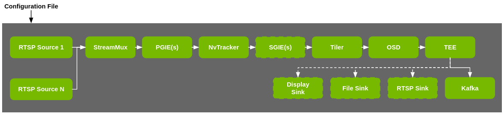

# Metropolis Perception App

The Metropolis Perception App (deepstream-fewshot-learning-app) consists of a ds pipeline with a PGIE & SGIE(s) that act as embedding models to generate feature vectors and create metadata to send to message brokers (Kafka (default), Redis, etc..,).

## Architecture



Metropolis Perception Microservice leverages the Metropolis Perception App to run video analytics on camera streams.

More details can be found in [Metropolis Perception Microservice Documentation here](https://developer.nvidia.com/docs/mdx/dev-guide/text/MDX_Perception_Overview.html).

## Metropolis Perception Docker image from NGC

Users can download the Metropolis Perception docker image (used in [Metropolis Perception Microservice](https://developer.nvidia.com/docs/mdx/dev-guide/text/MDX_Perception_Overview.html)) from NGC.

NGC Docker image URL:

```
nvcr.io/nfgnkvuikvjm/mdx-v2-0/mdx-perception:2.1
```

The docker is saved in NGC's **nv-mdx** org and **mdx-v2-0** team [here](https://registry.ngc.nvidia.com/orgs/nfgnkvuikvjm/teams/mdx-v2-0/containers/mdx-perception).

## Build deepstream-fewshot-learning-app

The deepstream-fewshot-learning-app (Metropolis Perception App) source code here is also included inside Metropolis Perception Docker image. This docker image is based on [DeepStreamSDK 6.4 release](https://developer.nvidia.com/deepstream-sdk).

The code is stored at:

```
/opt/nvidia/deepstream/deepstream/sources/apps/sample_apps/deepstream-fewshot-learning-app/
```

The source can be built using [DeepStream 6.4 docker image](https://catalog.ngc.nvidia.com/orgs/nvidia/containers/deepstream):

```
nvcr.io/nvidia/deepstream:6.4-triton-multiarch
```

Steps:

1. Run the docker container:

```
docker run --gpus all -it --rm --net=host --privileged -v /tmp/.X11-unix:/tmp/.X11-unix -e DISPLAY=$DISPLAY -w /opt/nvidia/deepstream/deepstream-6.3 nvcr.io/nvidia/deepstream:6.4-triton-multiarch
```

2. COPY Metropolis Perception App source code into the container:

```
COPY the folder deepstream-fewshot-learning-app at:
/opt/nvidia/deepstream/deepstream/sources/apps/sample_apps/deepstream-fewshot-learning-app
```

3. BUILD and install

```
cd /opt/nvidia/deepstream/deepstream/sources/apps/sample_apps/deepstream-fewshot-learning-app
export CUDA_VER=12.2
make
make install
```

4. RUN app (sample command; similar to Metropolis deployment command in Perception microservice (k8s and docker-compose))

```
./deepstream-fewshot-learning-app -c mtmc_config.txt -m 1 -t 1 -l 5 --message-rate 1 --tracker-reid 1 --reid-store-age 1
```

Please check the code `deepstream_fewshot_learning_app.c` to understand the command-line-arguments.

Note: The FPS logs from app run might look different from the Metropolis deployment logs (k8s and docker-compose).

Note: Please edit `[sink1]` config group settings in the file below with a valid Kafka broker.

```
/opt/nvidia/deepstream/deepstream/sources/apps/sample_apps/deepstream-fewshot-learning-app/configs/mtmc/mtmc_config.txt
```